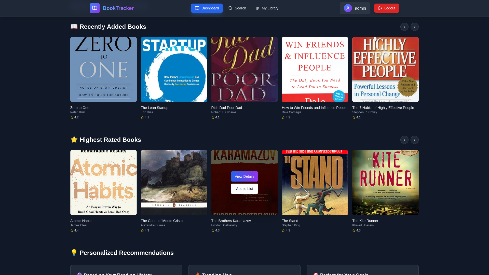
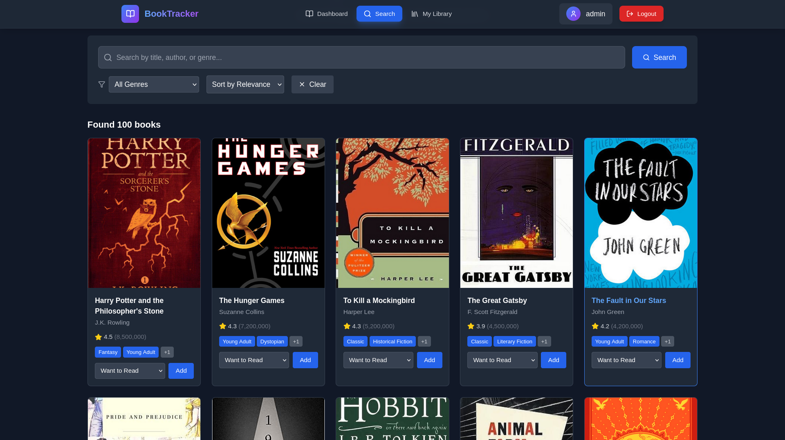

# 📚 BookTracker - MyAnimeList-Inspired Book Management System

A modern, full-stack web application for tracking and managing your personal book collection. Built with React, TypeScript, Spring Boot, and PostgreSQL, featuring a beautiful MyAnimeList-inspired user interface.

## 🌟 Features

### 📖 Core Functionality
- **Personal Library Management** - Organize books into custom shelves (Reading, Completed, Want to Read, Dropped)
- **Advanced Search & Discovery** - Find books by title, author, genre with intelligent filtering
- **Rating System** - Rate books with a 5-star system and track your reading history
- **Reading Goals** - Set and track annual reading goals with progress visualization
- **Personalized Recommendations** - Get book suggestions based on your reading preferences

### 🎨 Modern UI/UX
- **MyAnimeList-Inspired Design** - Beautiful, clean interface with modern gradients and animations
- **Responsive Design** - Optimized for desktop, tablet, and mobile devices
- **Dark/Light Mode Support** - Automatic theme switching based on user preference
- **Interactive Components** - Smooth animations, hover effects, and micro-interactions
- **Professional Typography** - Clean, readable fonts with proper hierarchy

### 🔧 Technical Features
- **Full-Stack Architecture** - React frontend with Spring Boot backend
- **Type Safety** - Full TypeScript implementation for better development experience
- **Authentication & Authorization** - Secure JWT-based user authentication
- **RESTful API** - Well-structured backend API with proper error handling
- **Database Integration** - PostgreSQL database with Docker Compose setup
- **State Management** - Context API for efficient state management

## 🚀 Tech Stack

### Frontend
- **React 18** - Modern React with functional components and hooks
- **TypeScript** - Type-safe development with enhanced IDE support
- **React Router** - Client-side routing with protected routes
- **Axios** - HTTP client for API communication
- **Vite** - Fast development server and build tool
- **CSS3** - Modern CSS with custom properties and animations

### Backend
- **Spring Boot 3** - Java-based backend framework
- **Spring Security** - Authentication and authorization
- **Spring Data JPA** - Database abstraction layer
- **PostgreSQL** - Robust relational database
- **Maven** - Dependency management and build tool
- **Docker Compose** - Containerized development environment

## 📸 Screenshots

### Landing Page

*Modern landing page with animated book stack and feature highlights*

### Dashboard

*Personal dashboard with reading statistics, goals, and recent activity*

### Search & Discovery

*Advanced search with filtering, sorting, and beautiful book cards*

### Library Management

*Organized bookshelves with rating and status management*

## 🛠️ Installation & Setup

### Prerequisites
- Node.js 18+ and npm
- Java 17+
- Docker and Docker Compose
- Git

### Quick Start

1. **Clone the repository**
   ```bash
   git clone https://github.com/yourusername/book-tracker.git
   cd book-tracker
   ```

2. **Start the database**
   ```bash
   cd book-backend
   docker-compose up -d
   ```

3. **Run the backend**
   ```bash
   cd book-backend
   ./mvnw spring-boot:run
   ```

4. **Run the frontend**
   ```bash
   cd book-frontend
   npm install
   npm run dev
   ```

5. **Open your browser**
   Navigate to `http://localhost:5173`

### Environment Configuration

#### Backend (`book-backend/src/main/resources/application.yml`)
```yaml
spring:
  datasource:
    url: jdbc:postgresql://localhost:5432/booktracker
    username: bookuser
    password: bookpass
  jpa:
    hibernate:
      ddl-auto: update
    show-sql: false

jwt:
  secret: your-secret-key
  expiration: 86400000
```

#### Frontend Environment Variables
Create a `.env` file in `book-frontend/`:
```env
VITE_API_URL=http://localhost:8080/api
```

## 📁 Project Structure

```
book-tracker/
├── book-frontend/              # React TypeScript frontend
│   ├── src/
│   │   ├── components/         # Reusable UI components
│   │   ├── pages/             # Page components
│   │   ├── context/           # React Context providers
│   │   ├── api/               # API client configuration
│   │   ├── data/              # Sample data and constants
│   │   └── types.ts           # TypeScript type definitions
│   ├── public/                # Static assets
│   └── package.json
├── book-backend/              # Spring Boot backend
│   ├── src/main/java/com/nathaniel/bookbackend/
│   │   ├── controllers/       # REST API controllers
│   │   ├── services/          # Business logic layer
│   │   ├── models/            # JPA entity models
│   │   ├── repository/        # Data access layer
│   │   ├── dto/               # Data transfer objects
│   │   ├── config/            # Configuration classes
│   │   └── security/          # Security configuration
│   ├── src/main/resources/    # Application configuration
│   └── pom.xml
└── README.md
```

## 🎯 Key Accomplishments

### Technical Excellence
- **Type-Safe Development** - 100% TypeScript coverage for better maintainability
- **Modern React Patterns** - Functional components, hooks, and context API
- **Responsive Design** - Mobile-first approach with CSS Grid and Flexbox
- **Performance Optimization** - Lazy loading, code splitting, and optimized bundle size
- **Security Best Practices** - JWT authentication, input validation, and CORS configuration

### User Experience
- **Intuitive Navigation** - Clear information architecture and user flow
- **Visual Hierarchy** - Proper use of typography, spacing, and color theory
- **Accessibility** - Semantic HTML, proper contrast ratios, and keyboard navigation
- **Loading States** - Skeleton screens and loading indicators for better UX
- **Error Handling** - User-friendly error messages and fallback states

### Code Quality
- **Clean Architecture** - Separation of concerns and SOLID principles
- **Component Reusability** - Modular, reusable components with clear props interfaces
- **Consistent Styling** - Design system with CSS custom properties
- **Error Boundaries** - Graceful error handling throughout the application
- **Documentation** - Comprehensive README and inline code documentation

## 🧪 Sample Data

The application comes pre-loaded with 100+ sample books including:
- Classic literature and modern bestsellers
- Diverse genres from sci-fi to romance
- High-quality cover images and detailed descriptions
- Realistic ratings and metadata

This sample data demonstrates the application's capabilities and provides an immediate, rich user experience for portfolio showcasing.

## 🔮 Future Enhancements

### Planned Features
- **Social Features** - Follow friends, share reading lists, and book reviews
- **Advanced Analytics** - Reading patterns, genre preferences, and time tracking
- **Book Recommendations** - Machine learning-based recommendation engine
- **Reading Challenges** - Community challenges and achievements
- **Mobile App** - React Native mobile application
- **API Integration** - Google Books API for expanded book database

### Technical Improvements
- **Testing Suite** - Unit tests, integration tests, and E2E testing
- **Performance Monitoring** - Application performance monitoring and analytics
- **Caching Strategy** - Redis for improved performance
- **CI/CD Pipeline** - Automated testing and deployment
- **Microservices** - Split backend into focused microservices

## 🤝 Contributing

This project is designed as a portfolio piece, but contributions are welcome! Please:

1. Fork the repository
2. Create a feature branch (`git checkout -b feature/amazing-feature`)
3. Commit your changes (`git commit -m 'Add amazing feature'`)
4. Push to the branch (`git push origin feature/amazing-feature`)
5. Open a Pull Request

## 📄 License

This project is licensed under the MIT License - see the [LICENSE](LICENSE) file for details.

## 👨‍💻 Developer

**Nathaniel**
- Portfolio: [Your Portfolio URL]
- LinkedIn: [Your LinkedIn Profile]
- GitHub: [Your GitHub Profile]
- Email: [Your Email]

---

*Built with ❤️ as a full-stack portfolio project showcasing modern web development practices and clean, maintainable code.*
